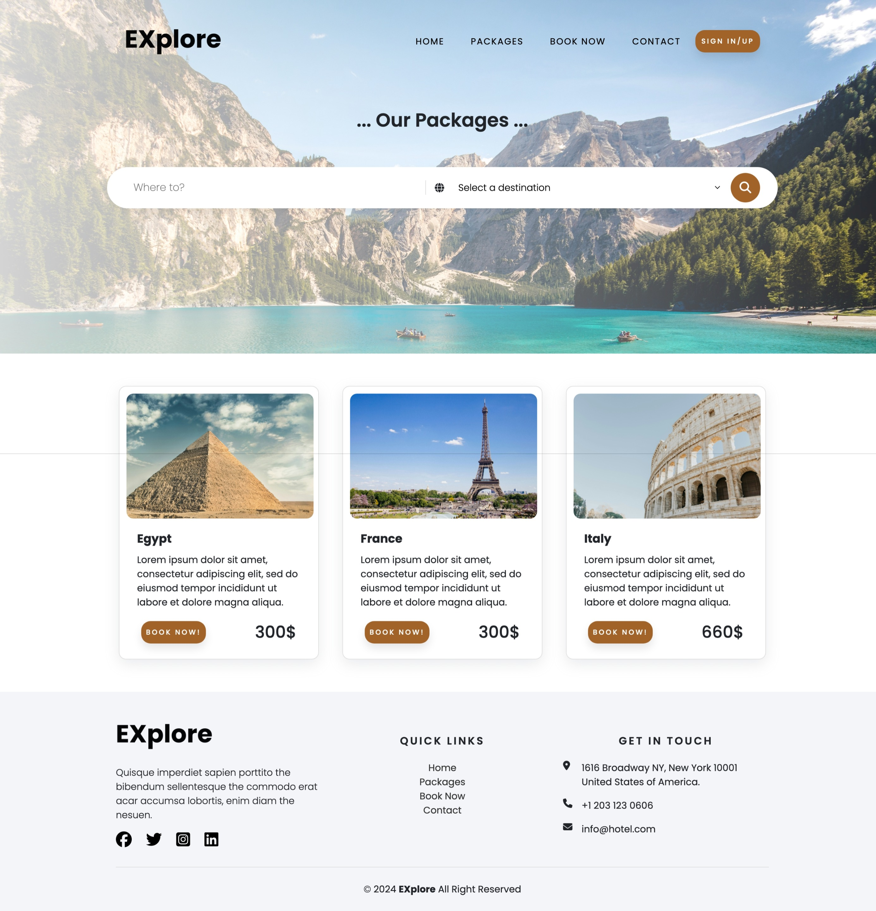

# Introducing “Explore” — Your Ultimate Travel Agency Solution

[EXplore](https://www.linkedin.com/in/doaa-abd-elfattah-41596a11a/) Project is a web application designed to simplify the process of finding and booking travel packages to various destinations around the world. The primary goal is to provide users with an intuitive and seamless platform where they can explore travel options, get detailed information about each destination, and make bookings with ease.

## 🎯 Who “Explore” Was Created For

“Explore” was created for small to medium-sized travel agencies looking to upgrade their online presence. These agencies often struggle with outdated websites and manual booking processes, which can lead to inefficiencies and lost business opportunities

## ✅ Features

- **Search Functionality**: Users can search for destinations and travel packages.
- **Responsive Design**: The website is fully responsive, ensuring a great user experience on both desktop and mobile devices.
- **Email Confirmation for Bookings**: After making a booking, users receive a confirmation email. This feature adds a layer of assurance and convenience, keeping users informed about their bookings and providing them with a record of their transaction.
- **Dynamic Loading of Packages**:
  The Explore Project dynamically loads travel packages directly from the database. This feature ensures that users always have access to the latest packages and deals, enhancing the overall user experience by providing real-time data.
- **Interactive Navigation**: Easy-to-use navigation bar with quick links to all major sections of the website.

## 🚀 Getting Started

To get a local copy up and running, follow these steps:

1. Clone the repository
2. Install dependencies
3. Run the application

## 💻 Technologies used:

- Front-end

  - html, css, Bootstrap

- Back-end
  - Python with Flask framework, mysql database

## 💻 Pages Included:

- Home Page
- Booking
- Packages
- Contact Us

## ❃ Authors

- Doaa Abdelfattah (Front-end)
  [LinkedIn](https://www.linkedin.com/in/doaa-abd-elfattah-41596a11a/)
  [GitHub](https://github.com/doaaabdelfattah)
- Alshaimaa Mamdouh (Back-end)
  [LinkedIn](https://www.linkedin.com/in/alshimaa-abdelaziz-04963b142/)
  [GitHub](https://github.com/alshimaamamdouh)
